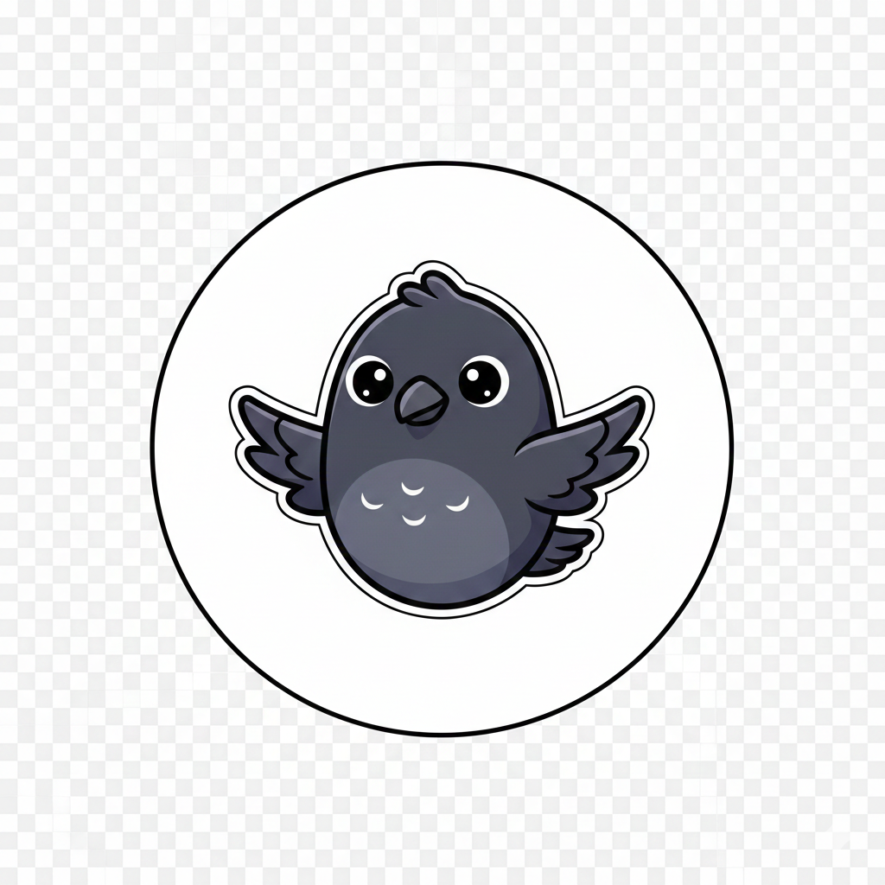

<div style="display: flex; align-items: center; gap: 1rem; margin-bottom: 1rem;">
  
  <h1 style="margin: 0; font-size: 3.5rem;">Kawai</h1>
</div>

The Cute agentic framework.

## Features

- **ReAct Pattern**: Implements Reasoning and Acting paradigm with strict one-tool-per-step execution
- **Tool Calling**: OpenAI-compatible function calling via OpenAI-compatible endpoint
- **Optional Planning**: Multi-step planning with configurable re-planning intervals
- **Rich Logging**: Color-coded console output with syntax highlighting
- **[Weave](https://weave-docs.wandb.ai/) Integration**: Automatic experiment tracking and observability
- **REST API Deployment**: Deploy agents as REST APIs with streaming support
- **Caching Strategies**: Aggressive prompt and tool caching strategies to save your token budget

## Installation

```bash
pip install git+https://github.com/soumik12345/kawai
```

## Quick Start

```python
import weave
from kawai import KawaiReactAgent, WebSearchTool, KawaiLoggingCallback, OpenAIModel

# Initialize Weave for tracking
weave.init(project_name="my-project")

# Create agent
agent = KawaiReactAgent(
    model=OpenAIModel(
        model_id="google/gemini-3-flash-preview",
        base_url="https://openrouter.ai/api/v1",
        api_key_env_var="OPENROUTER_API_KEY",
    ),
    tools=[WebSearchTool()],
    max_steps=10,
    callbacks=[KawaiLoggingCallback()]
)

# Run task
result = agent.run("What's the latest news on AI?")
print(result["final_answer"])
```

## Examples

* [Memory-augmented web-search agent](https://github.com/soumik12345/kawai/blob/main/examples/web_search.py)

## Built-in Tools

- **WebSearchTool**: Google search via Serper API
- **FinalAnswerTool**: Task completion (auto-added)
- **UserInputTool**: Interactive user prompts

## Creating Custom Tools

```python
from kawai.tools import KawaiTool, KawaiToolParameter
import weave

class CalculatorTool(KawaiTool):
    tool_name: str = "calculator"
    description: str = "Performs arithmetic operations"
    parameters: list[KawaiToolParameter] = [
        KawaiToolParameter(
            param_name="expression",
            description="Math expression to evaluate",
            tool_type="string"
        )
    ]

    @weave.op
    def forward(self, expression: str) -> dict:
        return {"result": eval(expression)}
```

## Planning Mode

Enable multi-step planning for complex tasks:

```python
agent = KawaiReactAgent(
    model=OpenAIModel(
        model_id="google/gemini-3-flash-preview",
        base_url="https://openrouter.ai/api/v1",
        api_key_env_var="OPENROUTER_API_KEY",
    ),
    tools=[WebSearchTool()],
    planning_interval=3,  # Re-plan every 3 steps
    max_steps=15
)
```

## Custom Callbacks

Monitor agent execution with custom callbacks:

```python
from kawai.callback import KawaiCallback

class MyCallback(KawaiCallback):
    def at_reasoning(self, reasoning: str):
        print(f"Thinking: {reasoning}")

    def at_tool_call(self, tool_name: str, tool_arguments: dict):
        print(f"Calling {tool_name}")

agent = KawaiReactAgent(
    model=OpenAIModel(
        model_id="google/gemini-3-flash-preview",
        base_url="https://openrouter.ai/api/v1",
        api_key_env_var="OPENROUTER_API_KEY",
    ),
    tools=[WebSearchTool()],
    callbacks=[MyCallback()]
)
```

## 🙏 Acknowledgments

Inspired by [HuggingFace smolagents](https://github.com/huggingface/smolagents). ReAct prompts adapted from their toolcalling agent implementation.
